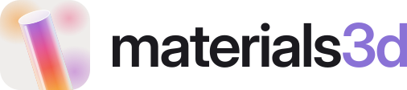

<picture>
  <source media="(prefers-color-scheme: dark)" srcset="brand/logo-dark.svg">
  
</picture>

**Scene-level refractive glass for the web.** Not a DOM filter, not a BSDF — a small renderer
where the colour lives _behind_ the glass and the glass bends it.

```bash
pnpm add @materials3d/react three     # or @materials3d/element, or @materials3d/core
```

```tsx
import { Materials3D } from "@materials3d/react";

<Materials3D preset="skewer" poster="/hero.webp" style={{ height: "100vh" }} />;
```

Built for hero sections and product visuals: near-white studio backdrop, shallow depth of field,
saturated cores against genuinely clear regions.

---

## Where this sits

`MeshPhysicalMaterial` already covers a lot of this. Transmission, `thickness`, `ior` and
`roughness` are the standard PBR glass path; `dispersion` landed in r164 implementing
`KHR_materials_dispersion`; `attenuationColor` / `attenuationDistance` are three's Beer–Lambert
volume absorption. Materials3D does not claim to have invented any of that, and if you want one
physically-grounded glass material you should use three's.

drei's `MeshTransmissionMaterial` is the closest neighbour, and its API documents the real
trade-off: with three's _shared_ transmission sampler, transmissive materials cannot see other
transparent objects, so it offers an optional per-mesh backside buffer. Rendering the scene twice
so glass can see glass is established art. Materials3D's variation is one **shared, scene-wide** plate
pass plus depth-validated sampling — cheaper with many objects, less accurate per object.

The "liquid glass" libraries that appeared after WWDC 2025 are a different thing entirely: SVG
displacement maps, `backdrop-filter`, per-element WebGL — all of them refracting **the page**.
The positioning line is short: _those libraries bend your DOM; Materials3D bends a scene._ Worth noting
the convergent evolution, though — they independently arrived at three-tap channel-split refraction
and rim-loaded displacement, which is good evidence those two choices are right rather than
idiosyncratic.

**What is actually Materials3D's**: the scene-level composition. The bounded lamp field, the
multi-pass inter-object refraction, and a post stack calibrated against a reference frame.

---

## How it renders

Four passes per frame:

| #   | pass  | target    | what it does                                                          |
| --- | ----- | --------- | --------------------------------------------------------------------- |
| 1   | depth | `depthRT` | linear depth packed across two channels for ~16-bit precision         |
| 2   | plate | `bgRT`    | the whole frame, glass falling back to the lamp field, depth in alpha |
| 3   | main  | `colorRT` | the same frame again, glass refracting pass 2                         |
| 4   | post  | screen    | DOF, saturation bloom, caustics, haze, vignette, grain                |

**Pass 1 hides the backdrop and clears to the encoded focal depth.** This sounds like a detail and
is the single largest visual improvement in the build. A backdrop sitting far outside the focal
range has a maximal circle of confusion, so every background pixel near a shape gathers ~14px of
that shape's colour and the whole frame turns to smeared watercolour. Backgrounds are smooth
gradients: they don't need blurring, and pinning them to the focal plane removes the bleed outright.

**Pass 3 is what makes glass refract glass.** Plain screen-space refraction ghosts the silhouette,
because every fragment displaces by a similar offset and shapes end up sampling other shapes _in
front of them_. Pass 2 stores linear depth in alpha and pass 3 rejects any sample nearer than the
current fragment. That validation is what buys the accuracy — with it the real-frame blend goes
from ~0.58 to ~0.94.

**Pass 4 weights bloom by saturation, not brightness.** A standard bright-pass does nothing here:
against a near-white backdrop the background _is_ the brightest thing in frame.

---

## Lamps: colour lives behind the glass

Colour is a **bounded** field behind the scene — a handful of soft Gaussian lamps with empty space
between them — not paint on the glass.

```ts
lamps: [
  { x: 0.5, y: 0.12, r: 0.128, color: "#f8c852", intensity: 1 },
  { x: 0.39, y: 0.26, r: 0.09,  color: "#f59d3e", intensity: 1 },
],
lampGain: 1.75,
lampGate: { lo: 0.12, hi: 0.9 },
```

`lampGate` is the part that matters. Without gating the Gaussian tails to zero, every lamp reaches
everywhere, every shape carries _some_ tint, and nothing reads as transparent. Gating is what
produces genuinely clear regions — and, counterintuitively, what lets the tinted regions be _more_
saturated, since coverage no longer has to be dialled down globally to keep things light.

`backdropLamps` shows the same field faintly on the backdrop itself (~5%). If colour appears _only_
inside glass, the eye reads it as tint however it was computed. A faint presence in the gaps is
what sells "behind".

### Transparent backgrounds

`background: "transparent"` (or `transparentBackground: true`) drops the backdrop so the scene
composites over whatever is behind the canvas — the usual hero case, glass over your own page.

Be clear about what it does: the gaps between shapes become transparent, and haze fades the shapes
out toward the page instead of painting a band of colour over it. The glass itself still refracts
the **lamp field**, not the page. Sampling the DOM is the one thing this renderer deliberately does
not do — that is what the liquid-glass libraries are for. Where no lamp sits behind a shape it
falls back to `clearGlass`, so set that to suit the surface you are sitting on.

`plate.z` is a critical parameter, not a detail. Far back, each shape acts as a full lens and smears
the whole gradient across its own width as rainbow banding. Close in (z ≈ -3) the hit point tracks
position and refraction reads as distortion of a continuous field. This one knob decides whether
the result looks like one gradient behind everything or like coloured plastic.

---

## Shapes

Almost everything is a lathe — a 2D profile swept about Y. Change the profile for rods, discs,
cones, spheres and rings; change the **segment count** for prisms, since a hexagon is just a lathe
with `sides: 6`. That one observation covers most of the geometry in this visual language.

| builder                                          | notes                                       |
| ------------------------------------------------ | ------------------------------------------- |
| `rod({ r, len, fillet, sides })`                 | flat-ended cylinder with a corner fillet    |
| `disc({ r, thickness, fillet })`                 | the same primitive, squat                   |
| `prism({ r, len, sides })` / `hex()`             | low segment count                           |
| `cone`, `sphere`, `ring({ r, hole, thickness })` |                                             |
| `slab({ w, h, depth, r, cuts })`                 | rounded-rectangular plate, flat to the lens |
| `extrude({ shape, depth, bevel })`, `arrow()`    | **not** lathes — swept 2D paths             |

Flat ends with a small fillet, not hemispheres. The fillet catches the rim highlight and the flat
face reads as an ellipse when tilted — a strong glass cue that a capsule loses.

Rotational symmetry is a trap: a lathed shape spun about its own axis of symmetry is _literally_
invisible, since the normal distribution is identical every frame. Either break the symmetry or
rotate about a different axis. `motions.skewer` does the latter.

### Carve-outs

Any shape with a flat profile takes `cuts` — a list of holes through it, for slotted plates:

```js
{ kind: "slab", len: 4.4, thickness: 5.6, depth: 0.62, r: 1.05,
  cuts: [{ kind: "rect", x: 0, y: 0, w: 0.56, h: 3.3, r: 0.28, rotation: 0 }] }
```

There are two cut kinds, `rect` and `circle`, because a slot is a `rect` whose corner radius has
reached half its short side and a circle is one whose radius has eaten it — the same economy that
makes a hexagon a lathe with `sides: 6`.

Honoured by `slab` and `arrow`, and by the plates (`disc`, `prism`, `hex`), which quietly swap
their lathe for the equivalent extrusion when they carry cuts. Ignored by the shapes whose profile
sweeps: `rod`, `sphere`, `cone`, `ring`, `droplet`, `blob`.

**Cuts go all the way through**, and that is a constraint of the renderer rather than a missing
feature. Thickness is measured as (back-face depth − front-face depth), so a hole open at both
ends simply draws nothing — exactly like `ring`, and exactly as correct. A blind pocket would
leave the front and back faces intact and report the empty cavity as solid glass, lighting the
shape as though the pocket were not there.

---

## Rendering without a browser

```bash
pnpm render assembly                          # → assembly.png at 1920×1080
pnpm render gallery/skewer.json -o hero.png
pnpm render --all -d renders/ -w 1200 -h 630
pnpm render slimes -t 2.5                     # the frame 2.5s in
```

The renderer is WebGL, so a scene cannot be rasterized without a browser — but it can be done
without a _studio_. `pnpm render` drives a headless Chromium through the same path the studio's
"Save still" uses (`setOutputSize`, then `captureImage`), so a headless render and a studio export
of one config are the same image.

Nothing waits on a frame loop. `captureImage` seeks to a fixed time and renders once, and the time
defaults to `0` — the frame a scene opens on — so **output is byte-identical between runs**. That
is what makes it usable for poster generation, gallery thumbnails and visual-regression diffing.

> Driving the live studio through a browser instead is a trap worth naming: `requestAnimationFrame`
> stops in a backgrounded tab, so the canvas holds a stale frame and every screenshot of it is a
> lie — silently, with no error anywhere.

Options: `-o/--out`, `-d/--dir`, `-w/--width`, `-h/--height`, `-t/--time`, `-q/--quality`, `--all`.
Output format follows the extension (`.png`, `.webp`, `.jpg`).

---

## Material

| option                                      | meaning                                                                                                                                                |
| ------------------------------------------- | ------------------------------------------------------------------------------------------------------------------------------------------------------ |
| `path`                                      | **half the optical path at normal incidence.** Tube radius for a rod, half the _thickness_ for a disc. Defaults are derived from the shape — see below |
| `density`                                   | absorption coefficient (σ)                                                                                                                             |
| `tint`                                      | a shape's own colour, instead of borrowing the lamps behind it                                                                                         |
| `ior`, `dispersion`                         | dispersion splits the three channels                                                                                                                   |
| `lens`                                      | rim-weighted screen-space displacement strength                                                                                                        |
| `rim`, `specular`, `saturation`, `emission` | finish                                                                                                                                                 |
| `hueShift`                                  | rotates the **refracted** colour around the hue wheel, in turns (0.5 = opposite hue) — reflections keep the true lamp colours. Mostly a binding target |

`path` used to be called `radius`, and the name invited the mistake it exists to prevent: it feeds
the Beer–Lambert chord, so passing a disc's 3.4-unit radius where its 0.38-unit half-thickness was
meant saturates absorption completely and the shape renders as opaque plastic. `defaultPath()`
derives it from the geometry, so you have to opt _in_ to getting it wrong.

The absorption uses an analytic chord — `2R·(N·V)`, long down the barrel and zero at the rim — with
a deliberate `pow(ndv, 0.40)` cheat. The true chord falls off so fast it leaves a wide white rim
eating most of the shape's width and only a thin coloured core survives.

Colour composites as **light, not pigment**: the naive `mix(white, tint, absorb)` darkens as it
saturates and looks muddy, so the shader takes the lamp's chroma and keeps the brightness of what
is behind. The chroma normalization is blended at 0.55 — going to full normalization turns smooth
gradients into hard posterized patches.

---

## Motion

Motion belongs to the **shape**, not the scene:

```ts
items: [
  { shape: { kind: "rod", … },  motion: { kind: "skewer", axis: "x", rate: 0.34 }, phase: 0.4 },
  { shape: { kind: "disc", … }, motion: { kind: "drift", rate: 0.42, amount: 0.16 }, phase: 1.7 },
]
```

A composition is usually a few things doing different things, and one scene-wide driver can only
express "everything does the same". The studio has an **apply to all shapes** button for when you
did want them uniform, and a `scatter` block carries a motion template it stamps onto every shape
it generates.

`phase` is where a shape sits in its cycle, and it is what turns a row into a travelling wave. It
has to spread across a full turn: cluster the phases and the trough sits still as a bald patch
instead of moving. `scatter.stagger` distributes it, in radians per shape — the studio shows that as **phase spread**,
measured in turns across the whole row, so the value that matters is simply 1. Changing the shape
count re-derives the step rather than leaving the row over- or under-covered.

The other thing that makes or breaks the reference motion is the lens. Rotation about a horizontal
axis should read as _foreshortening_; at 22° off-centre shapes lean instead and it reads as
tumbling. 12° from 44 units reads correctly.

For code-first scenes, `renderer.add(geometry, { motion })` sets a shape's motion, and
`motions.skewer` / `spin` / `drift` remain as `onFrame` callbacks for rules that span the whole set.

## Interaction

The trigger system from wave3d, ported: normalized 0..1 input signals — `scroll`, `hover`
(presence over the whole scene), `hoverSelf` (the cursor over THIS shape — the renderer raycasts;
item bindings only), `pointerX` / `pointerY`, `pointerSpeed`, `press`, `pressSelf` (a press that
began on this shape — click or, with `interaction.touch: true`, tap), `scrollVelocity`, `appear`
(a one-shot entrance latch), and `custom:<name>` fed via `renderer.setInteractionInput()` — drive config params through
**bindings**: `value = mix(from ?? authoredBase, to, smoothedSource)`, written straight to
uniforms, never into the config, so removing a binding needs no undo step.

```ts
lamps: [{ x: 0.35, y: 0.4, r: 0.2, color: "#f0803a", intensity: 1,
  bindings: [
    { source: "pointerX", target: "x", from: 0.1, to: 0.9 },
    { source: "pointerY", target: "y", from: 0.1, to: 0.9 },
  ]}],                                       // the lamp follows the cursor BEHIND the glass
interaction: { bindings: [{ source: "hover", target: "cameraZoom", to: 1.15 }] },
items: [{ …, interaction: { bindings: [{ source: "press", target: "emission", to: 0.4 }] } }],
```

Bindings live at three scopes: **scene** (`timeOffset`, `cameraZoom`, `lampGain`, and the post
knobs), **shape** (the transmissive optics, `hueShift`, `ripple`, `iridescence`, position), and
**lamp** (`x` / `y` / `radius` / `intensity` — which is the one wave3d didn't have, and the best
fit here: the colour lives behind the glass, so the thing that should follow your cursor is the
lamp). A `scatter` block takes the shape scope too: `scatter.interaction` is stamped onto every
shape it generates — each with its own copy, so `hoverSelf` means the rod under the cursor. The
skewers preset ships one: hovering a rod swings the colour of the light it refracts.
Absent blocks are fully off — no listeners attach, and the pixels are byte-identical. Touch is
ignored unless `interaction.touch: true`. Reduced motion, pauses and captures all settle to the
authored rest state (with `appear` at its _final_ value), so exports stay deterministic.

What deliberately did **not** port: wave3d's pointer field — hover swell, drag-wake, click
ripples. Those deform a membrane; these shapes are rigid.

## Packages

| package                                    | what                                                                             |
| ------------------------------------------ | -------------------------------------------------------------------------------- |
| [`@materials3d/core`](packages/core)       | the renderer, shapes, motions, presets, config model, and the poster-first shell |
| [`@materials3d/react`](packages/react)     | `<Materials3D preset="…" poster="…" />`                                          |
| [`@materials3d/element`](packages/element) | `<materials-3d>` for Vue, Svelte, or plain HTML                                  |

`three >= 0.180 < 1` is a peer dependency. The `.` entry of `@materials3d/core` has no static three
import at all — `createMaterials` reaches the engine through a dynamic import, so a bundler code-splits
three out of your initial load and fetches it only when a scene actually upgrades.

### Poster-first

This matters more here than for a gradient: four passes at high DPR is a real cost. The shell
shows a poster immediately and upgrades only when the container nears the viewport _and_ the
browser can run it, falling back permanently on no-WebGL, Save-Data, reduced motion, small
viewports, context loss, or a failed engine fetch.

```ts
createMaterials(el, config, {
  poster: "/hero.webp",
  minSizeForWebGL: 520, // a still frame of glass loses very little on a phone
});
```

`handle.snapshot({ time: 0 })` gives you the poster: a Blob of the frame the scene opens on, which
is reproducible rather than whatever happened to be on screen.

---

## Studio

```bash
pnpm install
pnpm dev            # http://localhost:5173
```

One JSON config drives the renderer, the panel and every export. Sections open expanded, because
the knob that matters is rarely the one you went looking for.

**Output**, **Performance** and **Actions** sit at the top: they are what you reach for repeatedly
and they are the same in every scene. The preset picker leads Actions, as a grid of **rendered
thumbnails** rather than a dropdown — "Skewer" and "Slimes" mean nothing until you have seen
them, and because the thumbnails are real renders of the presets they cannot go stale the way a
checked-in screenshot would.

**Shapes are editable in the viewport.** Double-click one to select it — its config folder expands,
scrolls into view and flashes. Then:

| gesture          | does                                        |
| ---------------- | ------------------------------------------- |
| drag             | move in the plane facing the camera         |
| shift-drag       | move along the view axis (depth)            |
| right-drag       | rotate about the camera's up and right axes |
| shift-right-drag | roll about the view axis                    |
| corner handle    | scale uniformly                             |

While a gesture is live the box takes on an accent ring and the badge reports the value you are
steering — `✥ -0.3 · -4.5 · -0.8` while moving, `⤢ 1.06×` while scaling, `↻ 9° · 17° · 0°` while
rotating (degrees, not the radians the config stores). Rotation additionally dashes the box's edge,
because a box being dragged and a box being turned otherwise look identical mid-gesture.

Rotation is about the **camera's** axes, not the world's: dragging right should tip the shape the
way it looks like it should tip whatever angle you have orbited to, and rotating about world X/Y
instead sends it turning in a direction the pointer never moved once the view is off-axis. Roll is
on shift because a two-axis drag cannot otherwise reach the third degree of freedom. The selection box is DOM rather than scene
geometry: an in-scene gizmo would go through the same four passes as everything else, so depth of
field would soften it and haze would fade it out exactly where you need it crispest.

Double-clicking a shape in a `scatter` scene bakes the scatter into a concrete `items` list first —
pixel-identical, since the same generator produced it — because a generated shape has no config of
its own to move or highlight. That is a normal undoable step, so it costs nothing to try.

A **?** beside undo/redo lists every gesture on hover — none of them are guessable, right-drag to
rotate least of all. **View → grid** overlays alignment guides on the preview: adjustable divisions
(3 gives rule-of-thirds) plus optional centre lines. It divides the frame rather than the world,
because what you are usually judging in a hero is where a shape sits in the picture. It lives above
the canvas as ordinary DOM, so it stays hairline-crisp and never reaches an export.

**Undo/redo** is a snapshot timeline: ⌘Z / ⇧⌘Z, a button cluster in the panel header, and a
version list where every entry carries its own thumbnail, an auto-derived label ("lamp gain",
"shuffle lamps", "Assembly") and a relative time. It lives in the panel rather than floating over
the stage — the render is the thing being designed, and a control parked on top of it is covering
the work. Click any entry to jump straight to it. Edits
coalesce per gesture, so dragging a slider is one step rather than one per frame, and Clear is
reversible for as long as its toast is up. The scene-authoring folders follow in the order the frame is
built up — light, backplate, camera, post, then the shapes and how they move.

Output sets the exact pixel size every export renders at, independent of the preview: presets from
a social card to 8K, a locked aspect ratio, and warnings before a size that will hurt. Four passes
means Materials3D pays roughly four times the fill rate of a single-pass renderer, so a 4K export here
costs about what an 8K one would elsewhere — which is exactly the intuition people arrive with. The
heavy presets are marked in the dropdown itself (`⚠ GPU heavy · 4K UHD · …`), so the cost is visible
before you pick rather than after.

Stills go to WebP, PNG or JPEG — but only the formats the browser can actually encode are offered,
since canvas encoders silently fall back to PNG rather than failing, which would hand you a `.webp`
that is really a PNG. Safari in particular has been inconsistent about `toDataURL("image/webp")`.
Anything excluded that way is named under the format rows ("Not encodable in this browser: …"),
because a format that simply vanishes from a dropdown looks like one that was never offered.

Clips record three ways, and the difference is worth knowing:

| format        | how                                                  | when                                                                         |
| ------------- | ---------------------------------------------------- | ---------------------------------------------------------------------------- |
| WebM / MP4    | `MediaRecorder` over the canvas stream, in real time | ordinary clips; MP4 only where the browser supports it, falling back to WebM |
| Animated WebP | frame-walked through `seek()`, muxed in the browser  | when you need it frame-exact, reproducible, or **with alpha**                |
| GIF           | frame-walked, quantized to 256 colours               | when the destination only takes a GIF                                        |

The frame-walked formats render frame N at exactly `N / fps` whatever that frame took, so a heavy
scene records at the intended speed instead of a slower-looking one. Animated WebP is also the only
recording format with somewhere to put a transparent background. The cost is that they step the
scene rather than playing it, so a long clip at a large size is a lot of encodes; the panel says so
before the wait.

GIF is offered because some places still only take one, not because it suits this renderer. A scene
built from smooth gradients and soft depth of field is exactly what a 256-colour palette destroys,
so expect banding; the long edge is capped at 640px because file size grows with area × frames; and
frames are flattened onto the background colour, since GIF's one-bit transparency would turn a soft
alpha edge into a speckled fringe. Reach for animated WebP unless something forces your hand.

Also exports a code snippet per framework, the raw config, a shareable link, and a self-contained
embed `.html` with the runtime inlined. The config editor is CodeMirror with a JSON linter, so a
stray comma is marked on its own line instead of reported as an offset.

Presets live in [`gallery/`](gallery) as plain JSON, generated from the shipped presets by
`pnpm gallery:build` and gated in CI by `pnpm gallery:validate`.

## Calibration

Art-directing this by eye repeatedly overshot, so the measurement ships as a tool.

```bash
pnpm calibrate reference.png render.png
```

The metric that matters most is the **clear-glass ratio** — the fraction of pixels that are
near-neutral but bright (saturation < 0.18, lightness > 0.72), i.e. reading as clear glass rather
than tinted. Against a 43% reference, successive builds measured 27% → 34% → 37% → 44%. Every one
of them had looked "about right" by eye.

The second measurement is the **hue histogram** of saturated pixels, which is how the palette was
derived rather than guessed: warm ≈ 39%, pink/magenta ≈ 36%, blue-violet ≈ 21%, green ≈ 2%, and
**no cyan at all**. A cosine palette sweeping full hue was wrong on the evidence. The studio's
Shuffle draws from that measured distribution.

---

## Known limits

State these up front rather than let people discover them:

- **No shadows.** Every shape floats. For a hero with objects resting on each other this is the
  most visible gap and the top roadmap item; contact shadows would close most of it.
- **Screen-space refraction** is bounded by what is on screen — shapes near frame edges refract
  clamped samples.
- **Caustics are a screen-space approximation**, not light transport: a downward
  saturation-weighted gather, not refracted photons.
- **Max 12 lamps** (fixed-size uniform array).
- **Four passes per frame.** Heavy at high DPR on mobile; poster-first is not optional.
- **No CSG.** Intersecting/boolean shapes need a real boolean library or pre-authored geometry.
- **Transparency is not DOM refraction.** A transparent background makes the gaps transparent; the
  glass still bends the lamp field, not the page behind it.
- **Colour is authored in display space**, not linear. three's colour management is deliberately
  bypassed for the pass chain, because the look was calibrated in display space and moving
  Beer–Lambert and the DOF/bloom gathers into linear changes their character. Pass colours as hex
  strings; a `new THREE.Color(hex)` handed to a uniform is linear and will read washed out.

---

## Roadmap

1. Contact shadows
2. Poster capture in CI (a Vite plugin, as `@wave3d/vite` does it)
3. More presets
4. A WebGPU/TSL backend behind a flag — the four-pass structure ports conceptually, the GLSL does not

---

## Credits & licence

Technique derived by reverse-engineering a public hero animation frame by frame; no code was
copied. Built on [three.js](https://threejs.org). The prior art above is referenced for
positioning, not derived from.

MIT.
