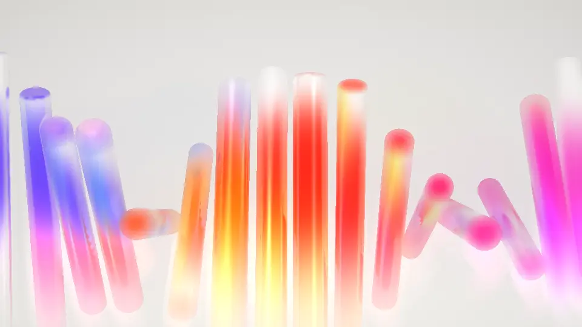

<picture>
  <source media="(prefers-color-scheme: dark)" srcset="brand/logo-dark.svg">
  
</picture>



---

[Live Studio](materials-studio.pages.dev)

Scene-level materials for the web, on three.js. A small four-pass renderer draws glass, frosted,
glitter, liquid, metal, ceramic and plastic shapes lit by soft lamps behind them: glass refracts
the scene behind it, a prism splits a traced beam, and the whole frame runs through one calibrated
post stack. Built for hero sections and product visuals. Ships as a React component, a custom
element and a plain TypeScript core, plus Materials Studio, a browser tool for designing scenes
and exporting them.

## Install

```bash
pnpm add @materials3d/react three     # or @materials3d/element, or @materials3d/core
```

## Quickstart

React (`preset` is one of `skewer`, `assembly`, `staircase`, `slimes`, `reactions`, `materials`,
`prism`, `orb`):

```tsx
import { Materials3D } from "@materials3d/react";

export function Hero() {
  return (
    <Materials3D
      preset="skewer"
      poster="/hero.webp"
      minSizeForWebGL={520}
      style={{ width: "100%", height: "100vh" }}
    />
  );
}
```

Custom element, for Vue, Svelte or plain HTML:

```html
<script type="module">
  import "@materials3d/element";
</script>

<materials-3d preset="skewer" poster="/hero.webp" style="display:block;height:100vh"></materials-3d>
```

Core, no framework:

```ts
import { createMaterials } from "@materials3d/core";

const hero = document.getElementById("hero")!;
const handle = createMaterials(hero, { lampGain: 2 }, { poster: "/hero.webp" });
```

Each entry point shows the poster first and fetches the engine (three included) only when the
container nears the viewport and the browser can run it. It stays on the poster on no WebGL,
Save-Data, reduced motion, a small viewport, repeated context loss or a failed fetch.

## What it is

Four passes per frame: depth; a plate pass that draws the whole scene with glass falling back to
the lamp field and depth written to alpha; a main pass that draws the scene again with glass
sampling the plate pass, rejecting any sample nearer than the fragment, so glass refracts other
glass without ghost silhouettes; and post (depth of field, saturation-weighted bloom, caustics,
haze, vignette, grain).

Colour is not painted on the shapes. It comes from a bounded field of Gaussian lamps behind the
scene, gated so the tails go fully clear; where no lamp sits behind a shape the glass shows
`clearGlass`. Internals, prior art and calibration: [docs/technique.md](docs/technique.md).

## Packages

| package                                    | contents                                                                        |
| ------------------------------------------ | ------------------------------------------------------------------------------- |
| [`@materials3d/core`](packages/core)       | the renderer, shapes, motions, presets, config model and the poster-first shell |
| [`@materials3d/react`](packages/react)     | `<Materials3D preset="..." poster="..." />`                                     |
| [`@materials3d/element`](packages/element) | `<materials-3d>` for Vue, Svelte or plain HTML                                  |

`three >= 0.180 < 1` is a peer dependency of every package. The `.` entry of `@materials3d/core`
has no static three import. `createMaterials` fetches the
engine through a dynamic import, so a bundler code-splits three out of the initial load. A second,
experimental WebGPU/TSL engine sits behind `renderer: "webgpu"`; see [WEBGPU.md](WEBGPU.md).

## Config

One plain JSON object drives the renderer, the studio panel and every export. `ensureSceneConfig`
fills a partial config out to a complete one. `background: "transparent"` (or
`transparentBackground: true`) drops the backdrop, so the gaps between shapes composite over the
page; the glass still refracts the lamp field, not the page.

### Lamps

Up to 12 Gaussian lamps in plate space (0-1 on each axis), each with `x`, `y`, `r`, `color` and
`intensity`. `lampGain` scales total coverage. `lampGate: { lo, hi }` is the smoothstep that cuts
the tails to clear. `backdropLamps` shows the same field faintly on the backdrop.

```ts
lamps: [
  { x: 0.5, y: 0.12, r: 0.128, color: "#f8c852", intensity: 1 },
  { x: 0.39, y: 0.26, r: 0.09, color: "#f59d3e", intensity: 1 },
],
lampGain: 1.75,
lampGate: { lo: 0.12, hi: 0.9 },
```

### Shapes

`items` is a list of `{ shape, position, rotation, scale, material, motion, phase }`. Shape kinds:
`rod`, `disc`, `prism`, `hex`, `cone`, `sphere`, `ring`, `arrow`, `droplet`, `blob`, `slab` and
`path` (an SVG outline, extruded). Flat-profile shapes take through `cuts` of kind `rect` or
`circle`. A `scatter` block generates a row of shapes from a seed in place of `items`.

### Material

Per shape, all optional: `kind` (`glass`, `frosted`, `glitter`, `liquid`, `metal`, `ceramic`,
`plastic`), `path` (half the optical path; derived from the shape unless set), `density`,
`absorption`, `tint`, `ior`, `dispersion`, `lens`, `bend`, `magnify`, `rim`, `specular`,
`saturation`, `hueShift`, `emission`, `roughness`, `iridescence`, `filmNm`, `ripple`,
`rippleScale`, `flow`, `sparkle`, `sparkleScale`, `albedo`, `edgeTint`.

### Motion

Per shape: `motion: { kind, axis, rate, amount }` with kinds `none`, `skewer`, `spin`, `drift`
and `wobble`, plus a `phase` in radians. `loopSeconds` snaps every rate to a whole number of cycles
so a recorded clip loops.

### Interaction

A binding maps a normalised input to a parameter: `value = mix(from ?? authored, to, smoothedSource)`.
Sources: `scroll`, `hover`, `hoverSelf`, `pointerX`, `pointerY`, `pointerSpeed`, `press`,
`pressSelf`, `scrollVelocity`, `appear`, `custom:<name>`. Scene bindings go in
`interaction.bindings` (`cameraZoom`, `lampGain`, `bloom`, `beamIncidence`, ...), shape bindings in
`items[i].interaction.bindings` (optics, `hueShift`, `positionX`, `positionY`), lamp bindings in
`lamps[i].bindings` (`x`, `y`, `radius`, `intensity`). They write uniforms, never the config. Touch
is ignored unless `interaction.touch` is true.

```ts
lamps: [{ x: 0.35, y: 0.4, r: 0.2, color: "#f0803a", intensity: 1,
  bindings: [
    { source: "pointerX", target: "x", from: 0.1, to: 0.9 },
    { source: "pointerY", target: "y", from: 0.1, to: 0.9 },
  ] }],
```

## Studio

Materials Studio is the design tool: presets as rendered thumbnails, a panel for the whole config,
shapes you can select and move in the viewport, undo/redo with a version list, and exports as a
still, a clip, code, config, a share link or an embed page. It runs locally with `pnpm dev` and
deploys to https://materials-studio.pages.dev on the first push to `main` (see DEPLOY.md).

The manual is [apps/studio/README.md](apps/studio/README.md). The shipped presets are also checked
in as JSON under [`gallery/`](gallery), regenerated by `pnpm gallery:build` and validated in CI.

## Known limits

- No cast shadows between shapes. The `wall` background mode draws a contact shadow where a shape meets the wall; nothing else casts one.
- Screen-space refraction is bounded by the frame. Shapes near the edge refract clamped samples.
- Caustics are a screen-space approximation: a downward saturation-weighted gather, not light transport.
- At most 12 lamps (a fixed-size uniform array).
- Four passes per frame. Heavy at high DPR on mobile, so ship a poster and set `minSizeForWebGL`.
- No CSG. Intersecting or boolean shapes need pre-authored geometry.
- A transparent background does not refract the page. The gaps go transparent; the glass bends the lamp field.
- Colour is authored in display space, not linear. Pass colours as hex strings; a `THREE.Color` handed to a uniform is linear and reads washed out.

## Roadmap

1. Contact shadows between shapes
2. Poster capture in CI
3. More presets
4. WebGPU engine parity ([WEBGPU.md](WEBGPU.md))

## Credits and licence

The technique was derived by reverse-engineering a public hero animation frame by frame; no code
was copied. Built on [three.js](https://threejs.org); adapted third-party code is listed in
[THIRD-PARTY-NOTICES.md](THIRD-PARTY-NOTICES.md). MIT.
