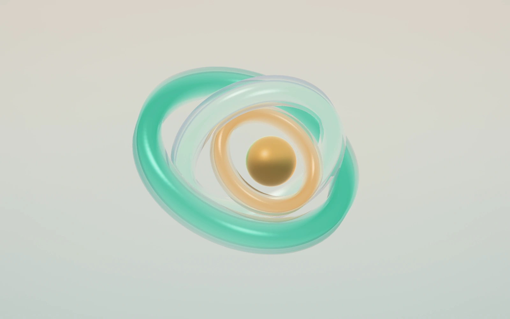

# Rendering and visual audit

September 5, 2026. Scope: the WebGL and WebGPU render pipelines, post shaders, preset authoring,
studio thumbnails, playback visibility, and exported frames.

## Changes

| Finding                                                                                              | Change                                                                                                                    | Result                                                                                                                                 |
| ---------------------------------------------------------------------------------------------------- | ------------------------------------------------------------------------------------------------------------------------- | -------------------------------------------------------------------------------------------------------------------------------------- |
| Front depth was rendered with a closed aperture, although only depth of field consumes it.           | Both engines skip that scene pass when the resolved aperture is zero. The front-depth diagnostic still works.             | One fewer geometry pass in sharp scenes, including Assembly and Prism.                                                                 |
| Selecting pyramid bloom ran its blur chain even with bloom intensity zero.                           | Gate work on the live bloom uniform. Keep the lower levels needed by dust.                                                | Disabled bloom stops doing invisible work; interactions can re-enable it immediately.                                                  |
| WebGPU blurred an unused fourth bloom level, then overwrote it for dust.                             | Build through level 2 for bloom or level 1 for dust alone.                                                                | Three fewer fullscreen passes for normal pyramid bloom, with more savings when only dust remains.                                      |
| WebGPU's post shader gathered depth, bloom and caustics when those effects were disabled.            | Add uniform branches matching the WebGL shader.                                                                           | Closed aperture avoids 58 depth/color lookups at quality 1; disabled gather bloom avoids 24, and disabled caustics avoids 10.          |
| WebGPU antialiased the main target only when tone mapping was enabled.                               | Use four coverage samples on its main target for ordinary scenes too, matching WebGL.                                     | Smoother curved silhouettes and cutout edges. Adds multisample storage and a resolve to that target; the byte plate remains unsampled. |
| The post parity test compared against an old hand-copied shader without the current depth prefilter. | Test the shipped GLSL, add four cases with runtime effect uniforms, and put assignment probes inside TSL function scopes. | The shader check now exercises the actual post implementation and all cases pass.                                                      |

Pass gating reads uniforms after interaction evaluation. It does not rely on the authored config
alone: a scene with `post.aperture: 0` and a hover binding must still draw fresh depth when hovered.
`scripts/render-gating.mjs` verifies this in both engines by switching effects off → on → off,
checking the render count and comparing the enabled frame with directly authored settings.

## Measured rendering work

Local Chrome, 960 × 540 output, device pixel ratio 1, fixed time 0. Counts are renderer calls per
scene frame, including fullscreen blits, not mesh draw calls. The capture API also paints a
restoration frame in WebGL, so its recorded counts were divided by two and verified with the
single-frame binding test.

| Scene                     | WebGL before → after | WebGPU before → after |
| ------------------------- | -------------------- | --------------------- |
| Assembly                  | 5 → 4                | 5 → 4                 |
| Prism                     | 20 → 19              | 23 → 19               |
| Prism, bloom 0 and dust 0 | 16 → 5               | 19 → 5                |
| Prism, bloom 0 with dust  | 20 → 15              | 23 → 15               |

These are measured reductions in submitted work, not an FPS claim. Short `captureImage` timings
included PNG encoding and scheduling noise and did not establish a consistent frame-time gain.
No field Core Web Vitals or mobile GPU measurements were collected.

All eight existing WebGL presets were rendered before and after at 960 × 540 and were pixel
identical. Before the separate antialiasing change, the four WebGPU performance cases differed by
at most 1/255, with most identical. The antialiasing change intentionally changes silhouette pixels
in WebGPU's byte-target scenes. No shader errors occurred in the Chrome pipeline checks.

## Aperture



The new `aperture` preset uses four primitives: jade, opal and amber glass rings around a brass
sphere. Opposing tilts reveal thickness, restrained dispersion keeps the inner rims legible,
and slow drift moves reflections without pulling the composition apart. Depth of field and
caustics are disabled. A minimum visible width keeps the outer ring inside phone-sized canvases
without retaining all the empty space of the desktop frame.

Available through `PRESETS.aperture()`, `preset="aperture"`, the studio picker, and
`gallery/aperture.json`. It uses no external models or textures.

## Follow-up opportunities

- **Adaptive resolution:** the default DPR ceiling is 1.75, which can shade roughly 3.06 times the
  pixels of DPR 1 before quality scaling. An opt-in controller driven by sustained frame cost could
  help embedded mobile scenes. Keep explicit exports fixed at their requested resolution.
- **Idle scenes:** visibility and reduced-motion handling already exist. A running scene with no
  motion, video, dust, liquid flow or active interaction can still render continuously. A future
  invalidation scheduler should account for all those consumers before suspending it.
- **Geometry reuse:** `buildItems()` builds each scattered shape separately. Identical scatter
  geometry could be shared with reference-counted disposal; varying shape dimensions and imported
  meshes need separate cache keys. This reduces construction and memory costs, not automatically
  material draw calls.
- **Refraction boundaries:** the screen-space plate still clamps refraction near frame edges,
  and HDR plates average depth-bearing alpha under multisampling. Changes here need dedicated
  overlap and edge fixtures; globally retuning lamps or blur would conceal the problem.

## Validation

```sh
pnpm check
pnpm build
node scripts/tsl-parity.mjs
pnpm render:check
node scripts/render.mjs --all -w 960 -h 540 -d renders/audit-after
node scripts/render.mjs aperture -w 390 -h 844 -o renders/aperture-mobile.png
```

The browser scripts require an installed Playwright Chromium. Hardware performance comparisons
should use local Chrome rather than headless WebGPU's software adapter. The existing
`scripts/tsl-perf.mjs` documents its capture-time measurement limits.
